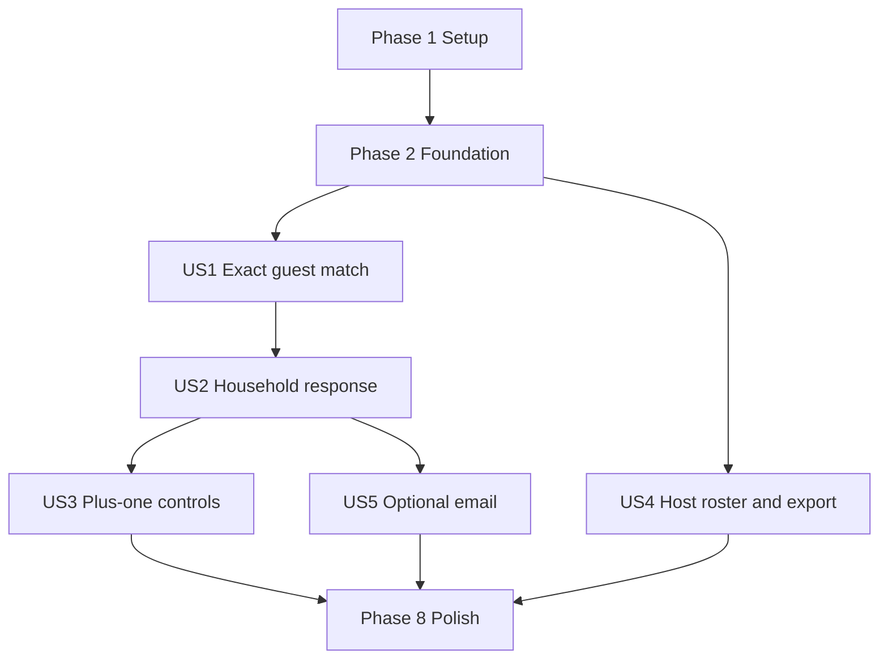

# Tasks: Guest-Matched Early RSVP

**Input**: Design documents in `specs/003-guest-matched-early-rsvp/`

**Prerequisites**: `plan.md`, `spec.md`, `research.md`, `data-model.md`, `contracts/ui-interactions.md`, and `quickstart.md`

**Provider**: Neon managed PostgreSQL Free, accessed only from Next.js server routes with `@neondatabase/serverless`. No locally hosted database is required.

**Tests**: Story-specific Vitest, component, and Playwright tasks are included because the spec defines independent test journeys and the plan requires those test suites.

**Organization**: Tasks are grouped by the five user stories in priority order. User-story tasks use `[US1]` through `[US5]` for traceability.

## Phase 1: Setup

**Purpose**: Add only the dependencies and setup guidance needed for the selected hosted implementation.

- [X] T001 [P] Add `@neondatabase/serverless` and `csv-parse` to `package.json` and `package-lock.json`; verify both remain compatible with the supported Node.js runtime.
- [X] T002 [P] Populate `.env.example` with server-only `DATABASE_URL`, `RSVP_ADMIN_PASSWORD_HASH`, and `RSVP_SESSION_SECRET` placeholders; allowlist only `.env.example` in `.gitignore` and complete generated-file ignores in `eslint.config.mjs` without adding real credentials or `NEXT_PUBLIC_*` secrets.
- [X] T003 [P] Write `docs/rsvp-setup.md` with Neon Free project and development-branch setup, manual migration application through the Neon SQL Editor, Vercel environment configuration, current quota/cold-start caveats, backup/export, and post-event deletion steps.

---

## Phase 2: Foundational

**Purpose**: Establish private storage, shared types, session boundaries, and durable throttling before implementing any guest or host story.

- [X] T004 [P] Create `database/migrations/0001_rsvp_core.sql` with versioned guest lists, households, invitees, party submissions, per-person attendance, granted plus-one responses, and lookup-attempt windows; add uniqueness, foreign-key, status, and plus-one constraints.
- [X] T005 [P] Create `lib/rsvp/db.ts` as a server-only Neon HTTP query client using `DATABASE_URL`; prevent database imports from client components.
- [X] T006 [P] Define domain and request/response types in `lib/rsvp/types.ts` for roster versions, households, invitees, sessions, submissions, attendance, plus-ones, and import results.
- [X] T007 Implement shared field and submission validators in `lib/rsvp/validation.ts` using `lib/rsvp/types.ts`, including bounded names, attendance enums, nullable valid email, and rejection of unexpected request fields.
- [X] T008 Implement short-lived household-scoped invitation cookie signing and verification in `lib/rsvp/session.ts`; bind each session to invitee, household, and roster version.
- [X] T009 [P] Implement host passphrase verification and signed host-session cookies in `lib/rsvp/admin-auth.ts`; use the server-only hash and signing secret, secure cookie attributes, expiry, and constant-time verification.
- [X] T010 Implement atomic, database-backed lookup-attempt throttling in `lib/rsvp/rate-limit.ts`; store only a keyed client-identifier hash and expiry state, never raw IP addresses or attempted names.
- [X] T011 [P] Add a synthetic UTF-8 roster fixture with multiple households and both plus-one permissions in `tests/fixtures/rsvp-guests.csv` for automated journeys; do not use real guest data.

**Foundation checkpoint**: Apply `database/migrations/0001_rsvp_core.sql` to a Neon development branch using `docs/rsvp-setup.md`; verify server-only environment configuration and run `npm.cmd run typecheck` before beginning story implementation.

---

## Phase 3: User Story 1 - Find and Open an Invitation (Priority: P1)

**Goal**: A guest matches by exact first and last name and sees only their unique household invitation; an unknown or ambiguous match reveals no roster information.

**Independent Test**: With the synthetic roster published in the Neon development branch, verify an exact match opens its household, unknown/ambiguous names return the same generic failure, repeated failures are throttled, and no roster data appears in public HTML or assets.

### Tests for User Story 1

- [X] T012 [P] [US1] Add unit tests for case/outer-whitespace normalization, accents and punctuation preservation, exact-only lookup, and duplicate-name rejection in `tests/unit/rsvp-matching.test.ts`.
- [X] T013 [P] [US1] Add component tests for lookup validation, pending state, generic no-match feedback, and matched-household display in `tests/component/guest-rsvp-lookup.test.tsx`.
- [X] T014 [P] [US1] Add Playwright coverage for valid, unknown, ambiguous, and rate-limited lookups in `tests/e2e/rsvp-guest-access.spec.ts`.

### Implementation for User Story 1

- [X] T015 [US1] Implement trimmed, case-insensitive exact first/last matching with explicit ambiguity handling in `lib/rsvp/matching.ts`.
- [X] T016 [US1] Implement a server-only roster query and matched-household lookup service in `lib/rsvp/repository.ts` and `lib/rsvp/guest-lookup.ts`; return only the uniquely matched household and its current response.
- [X] T017 [US1] Implement `POST /api/rsvp/lookup` in `app/api/rsvp/lookup/route.ts`; validate input, apply durable throttling, set the scoped invitation cookie, and return indistinguishable generic failures for unknown or ambiguous names.
- [X] T018 [US1] Build the accessible name-entry and invitation-summary states in `components/rsvp/guest-rsvp.tsx`, then replace the placeholder at `#RSVP` in `app/page.tsx` and `content/rsvp.ts` without changing canonical navigation.

**Checkpoint**: Story 1 works against the synthetic roster, exposes only its matched household, and passes its unit, component, and e2e tests.

---

## Phase 4: User Story 2 - Respond for a Household (Priority: P1)

**Goal**: A matched guest selects attendance separately for each household member, submits once, and receives confirmation only after the whole party response is saved.

**Independent Test**: Submit attending, declining, and undecided answers for one household; verify all answers persist together, confirmation summarizes them, and a repeat submission updates the current party response without duplicates.

### Tests for User Story 2

- [X] T019 [P] [US2] Add unit tests for complete household response validation, household membership, transaction failure behavior, and resubmission in `tests/unit/rsvp-submission.test.ts`.
- [X] T020 [P] [US2] Add component tests for per-person attendance controls, required response states, save progress, retained answers on failure, and confirmation in `tests/component/guest-rsvp-submission.test.tsx`.
- [X] T021 [P] [US2] Add a Playwright household journey that submits and later edits multiple invitees' responses in `tests/e2e/rsvp-household-submission.spec.ts`.

### Implementation for User Story 2

- [X] T022 [US2] Implement household-scoped response validation and one-transaction save/update behavior in `lib/rsvp/submission-service.ts` and `lib/rsvp/repository.ts`.
- [X] T023 [US2] Implement `POST /api/rsvp/submission` in `app/api/rsvp/submission/route.ts`; derive household authority from the invitation cookie and return success only after durable commit.
- [X] T024 [US2] Extend `components/rsvp/guest-rsvp.tsx` with per-invitee attending/declining/undecided controls, a single party submit action, saved-response review, and durable-save confirmation.

**Checkpoint**: All household responses save atomically; guests can revisit their invitation and update one current response per person.

---

## Phase 5: User Story 3 - Use Only Granted Plus-One Options (Priority: P1)

**Goal**: Only an invitee with a roster grant sees one plus-one slot, and the server rejects unauthorized extra guests even if a request is tampered with.

**Independent Test**: Compare granted and ungranted invitees; verify the granted slot may have an unnamed partner, while an altered submission cannot add a plus-one to an ungranted invitee or add a second guest.

### Tests for User Story 3

- [X] T025 [P] [US3] Add unit tests for granted, ungranted, unnamed, duplicate, and over-limit plus-one submissions in `tests/unit/plus-one-permissions.test.ts`.
- [X] T026 [P] [US3] Add component tests proving the `Guest of [Name]` slot appears only for granted invitees and accepts an optional name in `tests/component/guest-rsvp-plus-one.test.tsx`.
- [X] T027 [P] [US3] Add Playwright coverage for a granted plus-one and a tampered ungranted request in `tests/e2e/rsvp-plus-one.spec.ts`.

### Implementation for User Story 3

- [X] T028 [US3] Enforce one optional plus-one per explicitly granted invitee in `lib/rsvp/validation.ts`, validating the grant against the active roster rather than client input.
- [X] T029 [US3] Extend the transactional save path in `lib/rsvp/submission-service.ts`, `lib/rsvp/repository.ts`, and `app/api/rsvp/submission/route.ts` to persist authorized plus-one name and attendance or reject the full submission.
- [X] T030 [US3] Add the conditional `Guest of [Name]` row and optional partner-name field to `components/rsvp/guest-rsvp.tsx`; do not render an add-person control for ungranted invitees.

**Checkpoint**: UI and server enforcement agree for granted, ungranted, and tampered plus-one requests.

---

## Phase 6: User Story 4 - Maintain the Guest List and Review Replies (Priority: P2)

**Goal**: Hosts authenticate, preview and correct CSV imports, publish valid roster versions, review replies, and export a usable response file.

**Independent Test**: Import the valid fixture, correct invalid rows in a separate draft, verify invalid data cannot publish, publish a valid roster atomically, review seeded and submitted replies, and export flattened attendance and plus-one data.

### Tests for User Story 4

- [X] T031 [P] [US4] Add importer tests for empty/malformed files, required columns, duplicate IDs/names, missing households, and plus-one booleans in `tests/unit/guest-list-import.test.ts`.
- [X] T032 [P] [US4] Add host-component tests for row-level preview errors, publish blocking, response table values, and export action in `tests/component/rsvp-admin.test.tsx`.
- [X] T033 [P] [US4] Add a Playwright host journey for login, CSV preview, correction, publish, response review, and export in `tests/e2e/rsvp-host-management.spec.ts`.

### Implementation for User Story 4

- [X] T034 [US4] Parse UTF-8 CSV with `csv-parse` and validate roster rows, duplicate normalized names, group references, and plus-one permissions in `lib/rsvp/guest-list-import.ts`.
- [X] T035 [US4] Implement draft roster creation, atomic publish/version activation, response-version attribution, and host-only response/export queries in `lib/rsvp/repository.ts`.
- [X] T036 [US4] Add authenticated import-preview, publish, response-list, and CSV-export handlers to `app/api/admin/rsvp/route.ts`; return row-numbered errors and prevent partial publication.
- [X] T037 [US4] Build the protected host screen and CSV preview/publish controls in `app/admin/rsvp/page.tsx` and `components/rsvp/guest-list-import.tsx`.
- [X] T038 [US4] Build the host response table and flattened CSV download in `components/rsvp/response-table.tsx`, showing household, attendance, plus-one, optional email, roster version, and submission time.

**Checkpoint**: A host can safely publish a corrected roster and review/export responses without editing application code; invalid drafts never replace the active roster.

---

## Phase 7: User Story 5 - Share an Optional Email (Priority: P2)

**Goal**: Guests may omit email or submit a valid address for host follow-up; malformed addresses receive a field error without losing other answers.

**Independent Test**: Submit otherwise-identical party responses with blank and valid email and verify both succeed; submit an invalid address and verify it is rejected while attendance answers remain present.

### Tests for User Story 5

- [X] T039 [P] [US5] Add unit tests proving blank email is accepted, valid email is retained, and malformed email is rejected in `tests/unit/rsvp-email.test.ts`.
- [X] T040 [P] [US5] Add component tests for optional email labeling, invalid-email feedback, and preserved attendance answers in `tests/component/guest-rsvp-email.test.tsx`.
- [X] T041 [P] [US5] Add Playwright coverage for successful email-free and email-provided responses plus invalid-email recovery in `tests/e2e/rsvp-optional-email.spec.ts`.

### Implementation for User Story 5

- [X] T042 [US5] Persist nullable contact email with the household submission and validate it only when supplied in `lib/rsvp/submission-service.ts` and `lib/rsvp/validation.ts`.
- [X] T043 [US5] Add a labeled optional email field to `components/rsvp/guest-rsvp.tsx`; preserve all attendance and plus-one form values when email validation fails.
- [X] T044 [US5] Include the optional contact email in host-only response review and CSV export through `lib/rsvp/repository.ts` and `components/rsvp/response-table.tsx`.

**Checkpoint**: Email-free and valid-email RSVP journeys both succeed; invalid email never becomes an identity requirement or clears attendance answers.

---

## Phase 8: Polish & Cross-Cutting Concerns

**Purpose**: Complete deployment documentation, verify the integrated system, and confirm retention and cost boundaries.

- [X] T045 Update `docs/deployment.md` and `docs/rsvp-setup.md` for Neon-backed dynamic routes, Vercel server-only variables, migration rollout, host secret rotation, Neon Free limits, export, and post-event deletion.
- [X] T046 Run `npm.cmd run lint`, `npm.cmd run typecheck`, `npm.cmd run test`, `npm.cmd run test:e2e`, and `npm.cmd run build` against the completed feature; fix RSVP-related failures in the owning source/test files.
- [ ] T047 Execute every journey in `specs/003-guest-matched-early-rsvp/quickstart.md` against a Neon development branch and a Vercel preview; verify mobile/keyboard access, no public roster leakage, atomic saves, host export, and usage within the free plan.

**T046 validation note**: Lint, typecheck, production build, and all RSVP-specific browser journeys pass. The full Vitest suite retains three pre-existing failures in `tests/component/reveal.test.tsx`; the full Playwright suite retains ten failures in `tests/e2e/wedding-journeys.spec.ts` concerning schedule/reveal/gallery behavior. The RSVP-specific Playwright suite passes all 18 desktop/mobile tests, and the opt-in Neon schema-only branch smoke passes.

**T047 status**: Neon development branch journeys were verified against a schema-only branch. The Vercel Preview portion remains blocked until this repository is linked to a Vercel project and its Preview environment variables are configured.

---

## Dependencies & Execution Order

### Phase Dependencies

- **Setup (Phase 1)**: T001-T003 can start immediately and run in parallel.
- **Foundational (Phase 2)**: Depends on setup. T004-T011 establish the database, server boundaries, and synthetic fixture; all user stories depend on this phase.
- **User Stories (Phase 3+)**: Implement in priority order for a single contributor. All use the shared foundation.
- **Polish (Phase 8)**: Depends on all selected stories being integrated.

### User Story Dependencies

- **US1 (P1)**: Starts after Phase 2; uses the synthetic roster fixture so guest matching is independently demonstrable before host import exists.
- **US2 (P1)**: Depends on US1's scoped invitation session and matched-household response model.
- **US3 (P1)**: Depends on US2's party submission path so plus-one data is saved atomically with household attendance.
- **US4 (P2)**: Depends on Phase 2 host authentication and database foundation. It can be developed in parallel with US2/US3 by separate contributors, using seeded responses for export tests. A real host launch requires this story to import the actual roster.
- **US5 (P2)**: Depends on US2's party submission and may be developed in parallel with US4 after the submission contract stabilizes.

### Dependency Graph



### Parallel Opportunities

- Setup tasks T001-T003 modify separate dependency, environment-example, and documentation files.
- Foundation tasks T004-T006 and T009/T011 can be started in parallel; T007-T008 need the shared types, and T010 needs the schema and Neon client.
- The test tasks at the start of each story are in separate files and can be authored in parallel before implementation.
- After Foundation, US4 host workflows can be built alongside guest submission stories by separate contributors; integrate and run the combined e2e journey before polish.
- Keep tasks touching `components/rsvp/guest-rsvp.tsx`, `lib/rsvp/repository.ts`, or `lib/rsvp/submission-service.ts` sequential within each story to avoid conflicts.

## Parallel Examples

### User Story 1

```text
Task: T012 tests/unit/rsvp-matching.test.ts
Task: T013 tests/component/guest-rsvp-lookup.test.tsx
Task: T014 tests/e2e/rsvp-guest-access.spec.ts
```

### User Story 2

```text
Task: T019 tests/unit/rsvp-submission.test.ts
Task: T020 tests/component/guest-rsvp-submission.test.tsx
Task: T021 tests/e2e/rsvp-household-submission.spec.ts
```

### User Story 3

```text
Task: T025 tests/unit/plus-one-permissions.test.ts
Task: T026 tests/component/guest-rsvp-plus-one.test.tsx
Task: T027 tests/e2e/rsvp-plus-one.spec.ts
```

### User Story 4

```text
Task: T031 tests/unit/guest-list-import.test.ts
Task: T032 tests/component/rsvp-admin.test.tsx
Task: T033 tests/e2e/rsvp-host-management.spec.ts
```

### User Story 5

```text
Task: T039 tests/unit/rsvp-email.test.ts
Task: T040 tests/component/guest-rsvp-email.test.tsx
Task: T041 tests/e2e/rsvp-optional-email.spec.ts
```

## Implementation Strategy

### MVP First

1. Complete Setup and Foundation.
2. Complete US1 and validate exact guest matching with the synthetic roster.
3. Complete US2 and US3 for a complete guest-side household RSVP journey.
4. Complete the roster-import portion of US4 before real invitations are opened; US1 alone is a demo, not a host-usable launch.
5. Add the response review/export portion of US4 and US5, then run the full quickstart and deployment checks.

### Incremental Delivery

1. Setup + Foundation: Neon-backed server boundary, migration, sessions, auth, and throttling.
2. US1: exact match and scoped household reveal.
3. US2: independent per-person attendance and atomic party save.
4. US3: permitted plus-one and server-side tamper rejection.
5. US4: host roster import/publish and response review/export; required before real guest use.
6. US5: optional email capture and export.
7. Polish: deploy, verify, export, retention, and zero-cost quota boundaries.

## Format Validation

- Each task line starts with `- [ ] TNNN` and has a sequential task ID.
- `[P]` appears only on tasks that touch independent files and have no unfinished prerequisite.
- Every user-story task has exactly one `[USn]` label; Setup, Foundational, and Polish tasks have none.
- Every task description names the exact file path(s) it changes or the quickstart file to execute.
- Story test criteria and paths are stated before implementation tasks in each story phase.
